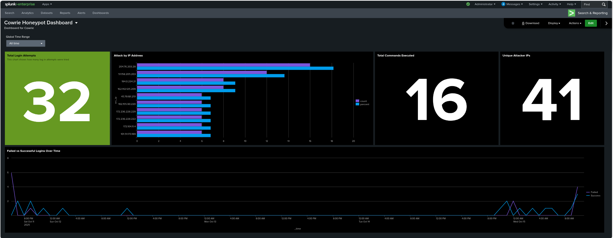

# 🧠 Cowrie Honeypot with Splunk SIEM Integration

---

## 📘 Overview

This project demonstrates an end-to-end **honeypot-to-SIEM pipeline** built using **Cowrie**, a medium-interaction SSH/Telnet honeypot, integrated with **Splunk Enterprise** for real-time attack detection, analysis, and visualization.

Deployed on **Microsoft Azure**, this setup captures live malicious activity, forwards logs via **Splunk Universal Forwarder**, and visualizes attacker behavior through a **custom Splunk dashboard**.  
It provides actionable insights into brute-force attempts, credential usage, and attacker interaction patterns.

---

## ⚙️ Architecture

## 🔍 Key Features

- **Live Threat Capture:** Records SSH/Telnet brute-force attempts and shell commands.  
- **Splunk Integration:** Parses and indexes Cowrie JSON logs for real-time analysis.  
- **Custom Dashboard:** Visualizes attacker IPs, usernames, commands, and session data.  
- **Cloud-Hosted:** Deployed on Azure to simulate real-world exposure securely.  
- **Automation Ready:** Includes cron job for Splunk health checks.  

---

## 📊 Dashboard Insights

| Metric | Description |
|--------|--------------|
| 🌍 **Total Login Attempts** | Counts all successful and failed SSH/Telnet logins captured by Cowrie to measure total attack activity. |
| 🔐 **Attack by IP Address** | Displays the top attacker IPs by frequency, allowing quick identification of the most active sources. |
| ⌨️ **Total Commands Ececuted** | Tracks all command inputs from intruders, revealing behavioral patterns and post-login activity. |
| 🕓 **Unique Attacker IPs** | Shows the number of distinct external IPs that interacted with the honeypot during the analysis window. |
| ⚠️ **Failed VS Successful Logins Over Time** | Visualizes attack trends, comparing failed and successful authentication attempts chronologically. |

---

## 📂 Repository Structure

| File / Folder | Description |
|----------------|-------------|
| `dashboards/cowrie_dashboard.json` | Splunk dashboard export |
| `configs/inputs.conf` | Splunk forwarder input configuration |
| `configs/props.conf` | Field extractions and sourcetype mapping |
| `configs/outputs.conf` | Target indexer definition |
| `scripts/splunk_health_check.cron` | Cron job to verify Splunk uptime |
| `docs/Cowrie_Splunk_Honeypot_Report_Omar_Alfayyadh.pdf` | Detailed write-up |
| `assets/img/` | Dashboard screenshots and architecture diagram |

---

## 🧩 Skills Demonstrated

- SIEM Integration (**Splunk Enterprise**)  
- Linux System Administration  
- Cloud Deployment (**Azure**)  
- Threat Intelligence & Log Analysis  
- JSON Parsing and Field Extraction  
- Security Monitoring and Visualization  

---

## 🧠 Insights

This project provided hands-on experience with:

- Setting up honeypots in production-like environments  
- Collecting and analyzing attacker data in real time  
- Understanding how attackers attempt credential exploitation  
- Building dashboards that transform logs into actionable intelligence  

---

## 🧾 Documentation

📄 [View Full Project Report (PDF)](docs/Cowrie_Splunk_Honeypot_Report_Omar_Alfayyadh.pdf)

---

## 🧑‍💻 Author

**Omar Al-Fayyadh**  
Cybersecurity Professional | Cloud Security Enthusiast  

🔗 [LinkedIn](https://linkedin.com/in/omaralfayyadh/) | 🎥 [YouTube](https://www.youtube.com/@omaral-fayyadh4307)
